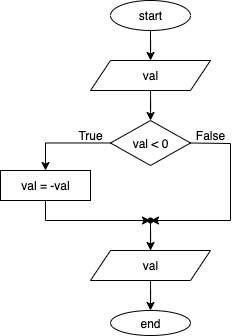
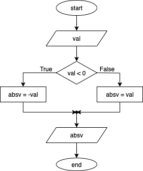
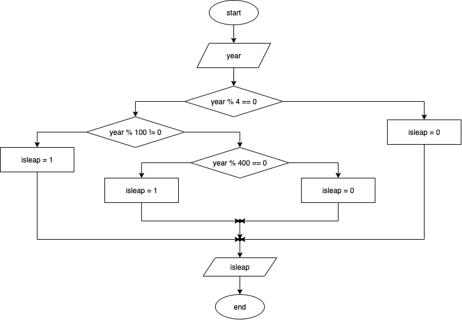
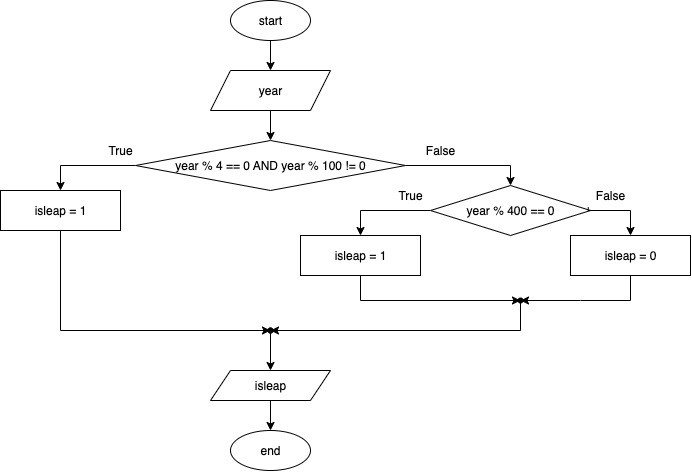
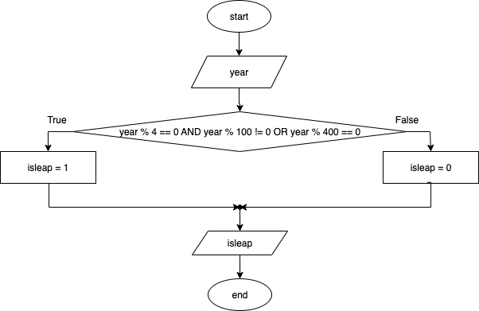
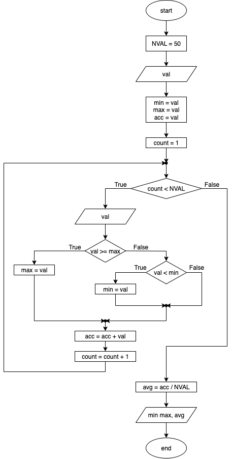

# Algorithms

+ control blocks: selection and loops
+ conditions
+ operators: `>`, `>=`, `<`, `<=`, `==`, `!=`
+ logical operators: `AND`, `OR`, `NOT`

## Exercises in class
Make a flowchart for an algorithm that asks for an integer and computes and displays its absolute value. 

{height=220px}

Second version that does not overwrites the initial value in input.

{height=220px}

---

Create a flowchart for an algorithm that asks the user to enter a year (as an integer) and checks if it is a leap year. If it is a leap year, display 1; if not, display 0.

{height=250px}

alternative, equivalent versions

{height=250px}

{height=250px}

**Note**: all versions are equivalent.

---

Create a flowchart for an algorithm that receives in input 50 integers. It computes maximum, minumum and average and displays the three results.

{height=650px}

## Proposed exercises
Create a flowchart for an algorithm that receives in input a sequence of integer values, that ends when the user inserts value `522`, which is not part of the dataset. The alorithm computes maximum, minumum and average and displays the three results. The user will surely insert at least an integer before they insert `522.

---

Create a flowchart for an algorithm that receives a positive integer as input, representing an amount in euros. The algorithm should calculate and display the number of €5 banknotes, €2 coins, and €1 coins needed to make up that amount, minimising the total number of pieces used.

---

Create a flowchart for an algorithm that, after receiving an integer value, calculates and displays 1 if the value is positive, 0 otherwise.

---

Create a flowchart for an algorithm that, after receiving an integer value, calculates and displays 1 if the value is odd, or 0 otherwise. Make a variation that does not use the remainder (modulus) operator.

---

Create a flowchart for an algorithm that takes three positive values and determines whether they form a Pythagorean triple. If they do, display 1; otherwise, display 0.

---

Create a flowchart for an algorithm that asks the user for a first strictly positive integer value — and keeps requesting it until a valid one is entered — which indicates how many values the user will then provide. The algorithm then reads the specified number of integer values, calculates, and displays their average.

---

Create a flowchart for an algorithm that takes a positive integer as input, then calculates and displays the largest digit in that number. For example, if the input is 3712, the output will be 7.

---

Create a flowchart for an algorithm that takes an integer value and displays `+` if the value is positive, `-` if it is negative, and a space character ` ` if it is zero.

---

Create a flowchart for an algorithm that, after receiving a single character as input, displays `v` if it is a vowel, `c` if it is a consonant, or `n` if it is a numeric character. The input character is guaranteed to be either a digit or an uppercase letter of the alphabet.

---

Create a flowchart for an algorithm that takes an integer value in the range `[1, 12]`, representing a month of the year (1 = January, etc.), and keeps requesting it until the value is valid. The algorithm then calculates and displays the number of days in that month.

**Note**: Create a first version that does not take leap years into account, and a second version that takes two integers — the month and the year — and displays the correct number of days for that month (note that both values are always entered, but the year may not always be used).

