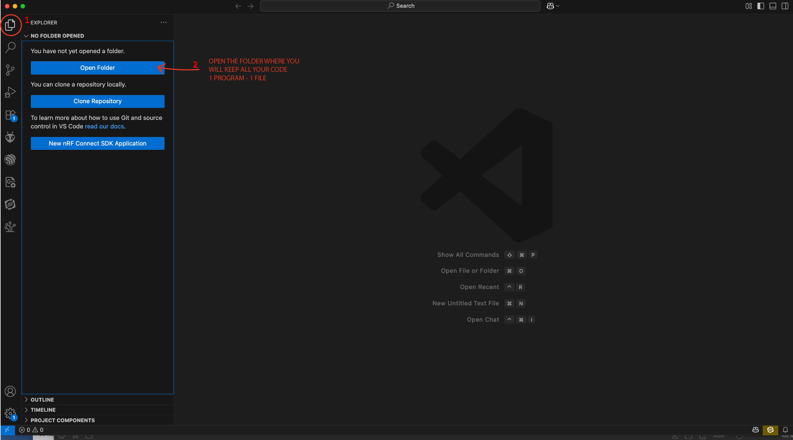

# Setup Guide: Python & VS Code

A short guide to install **Python** and **Visual Studio Code
(VS Code)** on both **Windows** and **macOS** devices.

------------------------------------------------------------------------

## 1. Install Python

### Windows

1.  Go to [Python Downloads](https://www.python.org/downloads/windows/).
2.  Download the latest **Python 3.x installer**.
3.  Run the installer:
    -   Make sure to check **"Add Python to PATH"** before clicking **Install Now**.
4.  Verify installation:
    - Open a PowerShell and type `python --version`: you should get something like `Python 3.11.7` (or a slightly different number) as an answer

    ``` bash
    python --version
    ```

### macOS

1.  Go to [Python Downloads](https://www.python.org/downloads/macos/).
2.  Download the latest **macOS 64-bit universal installer**.
3.  Open the `.pkg` file and follow the instructions.
4.  Verify installation:
    - Open a Terminal and type `python --version`: you should get something like `Python 3.11.7` (or a slightly different number) as an answer

    ``` bash
    python3 --version
    ```

------------------------------------------------------------------------

## 2. Install Visual Studio Code (VS Code)

1.  Download VS Code from <https://code.visualstudio.com/>.
2.  Run the installer (Windows: `.exe`, Mac: drag app to Applications).
3.  Launch **VS Code**.

------------------------------------------------------------------------

## 3. Set Up Python in VS Code


Open VS Code.

Install **Python Extension**:

    - 1.   Go to **Extensions (Ctrl+Shift+X)**.
    - 2.   Search for **Python** (by Microsoft).
    - 3.   Install.


------------------------------------------------------------------------

## 4. Find all your files and program

1. Select the File/Folder icon (or use from the Menu: **File -> Open Folder ...** )
2. Choose the folder where you keep all your code



